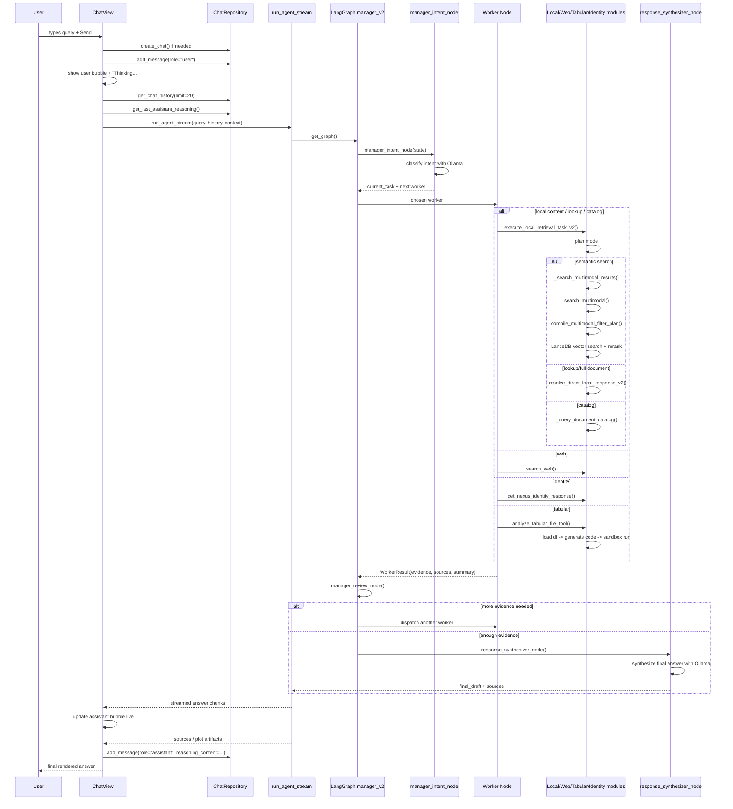

# Query Flow

This document explains what happens in code when a user submits a query in Nexus Local.

Current runtime note:
- The active pipeline in this workspace is `manager_v2` because `.env` sets `RAG_PIPELINE_VERSION=manager_v2`.
- The code default in `src/core/config.py` is still `legacy`, so this flow depends on runtime config.

## End-to-End Flow

1. App startup begins in `src/main.py`, which calls `run_app()`.
2. Flet bootstraps the UI in `src/ui/main.py`.
3. `src/ui/app_layout.py` creates `ChatView`, which is the main chat surface.
4. When the user presses Send, `src/ui/components/chat_view.py` runs `trigger_send()` and then `send_message()`.
5. `send_message()`:
   - validates the input
   - creates a new chat if needed
   - saves the user message through `src/core/database.py`
   - shows the user bubble and a `Thinking...` placeholder
   - loads recent chat history and previous assistant reasoning
   - calls `run_agent_stream()`
6. `src/ui/agent_interface.py` converts the chat history into LangChain messages, appends the new user query, and builds the graph input state.
7. `src/agents/graph.py` selects the active graph. In this workspace it uses `build_manager_v2_graph()`.
8. The graph starts at `manager_intent_node()` in `src/agents/nodes_v2.py`.
9. `manager_intent_node()` classifies the user request into an intent and chooses the first worker.
10. The graph routes to one of these workers in `src/agents/nodes_v2.py`:
    - `local_retrieval_worker_node()`
    - `local_catalog_worker_node()`
    - `web_retrieval_worker_node()`
    - `identity_worker_node()`
    - `tabular_worker_node()`
11. Worker internals:
    - Local retrieval uses `src/tools/local.py`
    - Web retrieval uses `src/tools/search.py`
    - Tabular analysis uses `src/tools/tabular.py`
    - Identity answers also use `src/tools/local.py`
12. For local semantic search, `src/tools/local.py` calls:
    - `search_multimodal()` in `src/rag/ingestion_multimodal.py`
    - `compile_multimodal_filter_plan()` in `src/rag/query_filters.py`
    - LanceDB helpers in `src/rag/lancedb_store.py`
13. After a worker finishes, `manager_review_node()` decides whether to:
    - dispatch another worker
    - or synthesize the final answer
14. Final synthesis happens in `response_synthesizer_node()` in `src/agents/nodes_v2.py`.
15. `src/ui/agent_interface.py` streams the final answer chunks, gathers sources and visual artifacts, and stores a reasoning snapshot for later follow-up questions.
16. `src/ui/components/chat_view.py` updates the assistant bubble live and finally saves the assistant response back to SQLite through `src/core/database.py`.

## Sequence Diagram

## Main Modules in Order

1. `src/ui/components/chat_view.py`
2. `src/core/database.py`
3. `src/ui/agent_interface.py`
4. `src/agents/graph.py`
5. `src/agents/nodes_v2.py`
6. One worker path from `src/agents/nodes_v2.py`
7. `src/tools/local.py`, `src/tools/search.py`, or `src/tools/tabular.py`
8. `src/rag/query_filters.py`
9. `src/rag/ingestion_multimodal.py`
10. `src/rag/lancedb_store.py`
11. Back to `src/agents/nodes_v2.py` for review and synthesis
12. Back to `src/ui/agent_interface.py` for streaming
13. Back to `src/ui/components/chat_view.py` for rendering and final persistence

## Legacy Note

If `RAG_PIPELINE_VERSION` is switched to `legacy`, the path changes:

1. `src/ui/components/chat_view.py`
2. `src/ui/agent_interface.py`
3. `src/agents/graph.py` -> `build_legacy_graph()`
4. `src/agents/nodes.py` -> `agent_node()`
5. LangGraph `ToolNode(TOOLS)`
6. Tool functions from `src/tools/registry.py`
7. Loop back to `agent_node()` until no more tool calls
8. Stream final output back through `src/ui/agent_interface.py`
